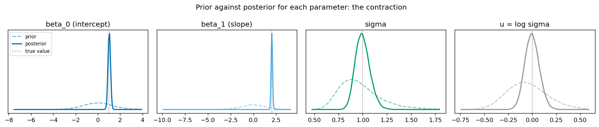
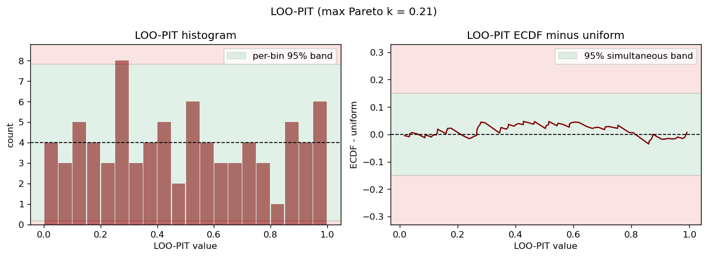

# toy-nuts

A No-U-Turn Sampler written from scratch in pure Python: leapfrog integration,
recursive tree doubling, the no-U-turn criterion and multinomial trajectory
sampling, with a diagnostic and calibration suite. 

Written for clarity rather than speed, it is still held to a hard standard. The
sampler is run on a conjugate Bayesian linear regression whose posterior is
Normal-Inverse-Gamma in closed form, so every number it produces can be checked
against the exact answer.

The picture below overlays the sampler's posterior (the filled histograms) on a
large i.i.d. draw from the closed-form posterior (the black outline); the two
match closely.


The rest of this README is the story behind that picture:
1. the question;
2. the machine that answers it;
3. the evidence that it converged; and
4. the evidence that the uncertainty it reports is honest. 

The same format runs interactively
across the three notebooks in [`notebooks/`](notebooks).

## The question

I observe responses $y$ at scalar inputs $x$ and fit a straight line with
Gaussian noise, $y = \beta_0 + \beta_1 x + \varepsilon$.

The prior is a conjugate Normal-Inverse-Gamma pair.
The prior covariance is set deliberately wide,
so before any data arrives the model spreads its predictive mass over a broad
range of outcomes and pays no attention to where the points actually fall.


Three views of the same prior predictive: the marginal density

$$
p(\tilde y \mid \tilde x) = \mathbb{E}_\theta[p(\tilde y \mid \tilde x, \theta)] \approx \frac{1}{S}\sum_s p(\tilde y \mid \tilde x, \theta_s)
$$

with its central 95% interval, the sample lines and the standard deviation each
draw implies against the observed value. The density averages the Gaussian
likelihood over the draws, which integrates the observation noise out per draw,
and the interval inverts the same mixture, so nothing about $\tilde y$ is sampled.
One colour convention runs throughout ([`plotting.py`](src/toynuts/plotting.py)):
cool for the prior, warm for the posterior, black for the data.

Because the prior is conjugate, the posterior is available in closed form, which
is the whole point: it gives an exact target to sample against.

## The machine

The sampler works on the unconstrained space, with $\sigma$ reparameterised as
$u = \log \sigma$. The potential is the negative log density and the kinetic energy
comes from a Gaussian momentum:

$$
U(q) = -\log \pi(q), \qquad K(p) = \tfrac{1}{2}\, p^\top M^{-1} p, \qquad H(q, p) = U(q) + K(p).
$$

A leapfrog step is a half momentum kick, a full position drift then a half kick,
all at a fixed step size $\epsilon$. NUTS grows a trajectory by doubling it until the
original no-U-turn criterion fires, a state diverges or the depth cap is reached.
The next sample is drawn from the trajectory with each state weighted by its
Boltzmann factor $e^{-H}$, biased towards the newest states so the chain travels as
far as it can.

The model contributes the log density and its analytic gradient, including the
change-of-variables Jacobian for $u = \log \sigma$. The gradient is validated
against finite differences in the test suite, so the dynamics are driven by a
gradient that is known to be correct.

There is no warm-up and no adaptation. The step size and the mass matrix are fixed
inputs, chosen once and held constant. The mass matrix here is diagonal, matched to
the analytic posterior scales, and the step size was picked to be robustly
divergence-free across a small grid of priors and seeds. This keeps the sampler
simple and its behaviour easy to reason about, at the cost of needing a friendly,
well-scaled target.

## The answer

Run four chains and the posterior collapses onto a tight band along the data,
the first figure above: the sampled marginals over the closed-form posterior,
including the scale $u = \log \sigma$. Every sampled posterior mean lands within
0.71 MCSE of its exact value and the standard deviations match to within 2%.

Laid against the prior, the same parameter densities show the contraction
directly: the wide dashed prior collapses onto the solid posterior, the scale
shown both as $\sigma$ and as $u = \log \sigma$.



The posterior predictive is the same three views as the prior, now averaged over
the sampler's own draws:

$$
p(\tilde y \mid \tilde x) = \mathbb{E}_{\theta \mid y}[p(\tilde y \mid \tilde x, \theta)] \approx \frac{1}{S}\sum_s p(\tilde y \mid \tilde x, \theta_s).
$$

These are the density and its central 95% interval, the sample lines and the
standard deviation each draw implies. The wide prior band has collapsed onto a
tight one that tracks the data, and the implied spread concentrates on the
observed value.


The posterior recovers the generating line and quantifies how sure it is about
it. Two questions remain: did the sampler actually converge, and
is the uncertainty it reports honest.

## Did it converge?

The convergence diagnostics are all computed from scratch in
[`diagnostics.py`](src/toynuts/diagnostics.py), no ArviZ. Across four chains of
2000 draws each:

| diagnostic            | result            | pass mark           | status |
|-----------------------|-------------------|---------------------|--------|
| split-Rhat (max)      | 1.0005            | at or below 1.01    | green  |
| bulk ESS (min)        | 5200              | above 400           | green  |
| tail ESS (min)        | 4291              | above 400           | green  |
| divergences           | 0                 | at or near 0        | green  |
| max tree depth        | 3                 | below the cap of 10 | green  |
| E-BFMI                | 0.93 to 1.03      | above 0.3           | green  |

The status column is the traffic-light coding from `diagnostic_status` (green
pass, amber inspect, red warn); the diagnostics notebook shades its table cells
with it.

The traces are fuzzy horizontal bands with no drift or sticking, and the four
per-chain densities lie on top of one another, which is what split-Rhat near 1
then confirms. The notebook adds the per-chain rank plots and autocorrelation
that corroborate this.


The energy diagnostic checks whether momentum refreshment explores the energy
distribution efficiently. The check is on spread: the energy
transition distribution should be about as wide as the marginal energy
distribution, and E-BFMI condenses that comparison into a number near one here.


## Is the uncertainty honest?

Convergence only shows the chains explored the posterior, not that the
uncertainty they report is trustworthy. The checks below test that, all from
scratch in [`calibration.py`](src/toynuts/calibration.py); each averages the
per-draw Gaussian CDF over the draws, so nothing about $\tilde y$ is sampled and
the conjugate shortcut is not used.

The headline check is the leave-one-out PIT: the predictive CDF at each training
point, reweighted by Pareto-smoothed importance sampling so the point is scored as
if held out. These should be $\mathrm{Uniform}(0, 1)$, and they are: the ECDF
stays inside its 95% simultaneous band, with mean 0.49 and largest Pareto $\hat k$
0.21 (below the 0.7 reliability limit). The held-out and stratified-by-$x$
versions are in the notebook.



Read as a calibration curve, the same averaged CDF gives quantile coverage on the
held-out set, each interval recovered by inverting the Rao-Blackwellised PIT
rather than from sampled replicates. The empirical coverage tracks the diagonal.


Among calibrated models the sharpest is preferred, so the notebook also reports
proper scores: the PSIS-LOO expected log predictive density is $-115.4 \pm 6.0$
with $p_\text{loo} = 2.8$ against three parameters, and the mean CRPS on the
held-out set is 0.56.

Simulation-based calibration tests the inference itself, not one dataset: draw
parameters from the prior, simulate data, refit and rank each true value among
its posterior draws. Those ranks are uniform under a correct sampler, and here
each parameter's ECDF stays inside its 95% simultaneous band (a lean to the edges
would mean posteriors too narrow, a central hump too wide).


The LOO-PIT, coverage, Pareto $\hat k$ and SBC checks agree: the posterior
predictive is calibrated out-of-sample and in-sample, with no sign that the
sampler's prior-to-posterior map is biased.

## Layout

```
src/toynuts/      the package: transforms, hamiltonian, integrators, trajectory,
                  transition, sampler, diagnostics, calibration, plotting, io
                  and the models
scripts/          run_linear_gaussian.py, make_plots.py, make_readme_figures.py
tests/            analytic and independently referenced checks
notebooks/        01_results, 02_diagnostics, 03_calibration, the narrative above
assets/           the rendered README figures
outputs/          gitignored Parquet runs and figures, one directory per run
```

## Running it

```bash
conda env create -f environment.yml
conda activate toy-nuts
pip install -e .                        # optional: the notebooks also add src/ to the path

python scripts/run_linear_gaussian.py   # run the sampler, write outputs/run_<timestamp>/
python scripts/make_plots.py            # read the run, render the figures
```

The notebooks are the recommended way in. `01_results.ipynb` is the only one that
runs the sampler: it fits the model, draws the figures above and writes the run
and a few derived quantities to `outputs/notebook_run`. `02_diagnostics.ipynb`
and `03_calibration.ipynb` are read-only, interpreting that saved run. The README
figures are regenerated from the same saved run with
`python scripts/make_readme_figures.py`.

## Validation

The end-to-end test recovers the analytic posterior mean and covariance of $\beta$
and the mean of $\sigma^2$ within a small multiple of MCSE, with split-Rhat below
1.01, bulk and tail ESS above 400 per parameter, divergences at or near zero and
E-BFMI above 0.9. The diagnostics themselves are checked against analytic
references: split-Rhat near 1 on i.i.d. draws, ESS against the AR(1) formula and
E-BFMI against a controlled energy series. The calibration functions are checked
against the cases where the answer is known: a uniform PIT and nominal coverage
for a matched predictive, and uniform ranks in the exchangeable case SBC reduces
to. The importance-sampling leave-one-out is checked against the exact conjugate
leave-one-out predictive, which is Student-t in closed form: the PSIS-LOO elpd
and LOO-PIT match it closely. The model's analytic gradient is checked against
finite differences, which is the single most important test, since the dynamics
ride on that gradient.

## Reproducibility and compute

Runs are reproducible: per-chain seeds spawn from one numpy `SeedSequence`, and
`run_config` records the seeds, settings and library versions. The predictive
checks stream over draws in chunks and average analytic per-draw densities, so
peak memory follows the chunk size, not chains times draws times points; the SBC
draws are thinned to the rank.

## Licence

MIT.
