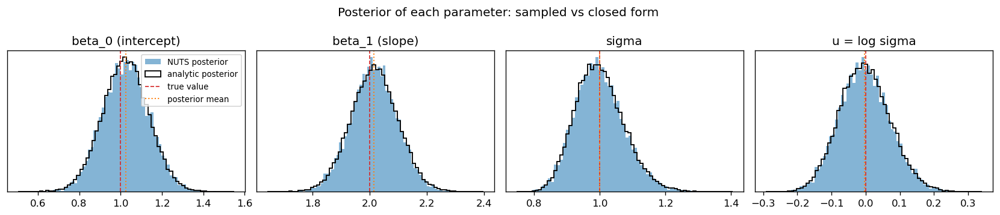
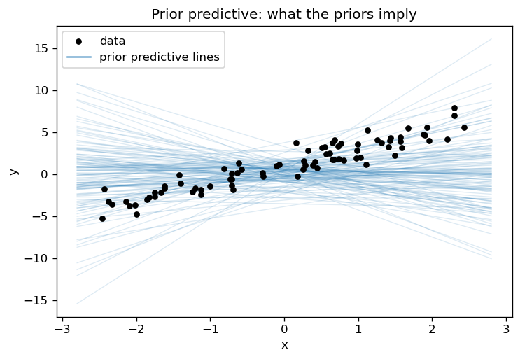
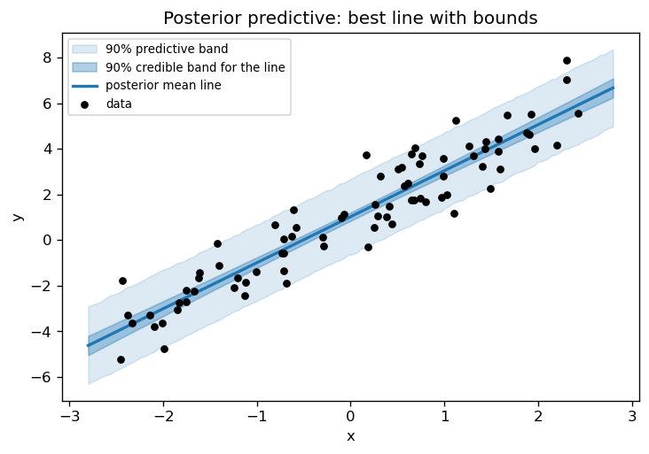
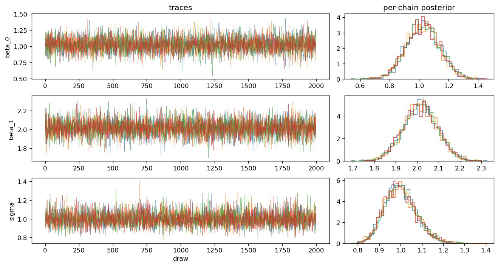
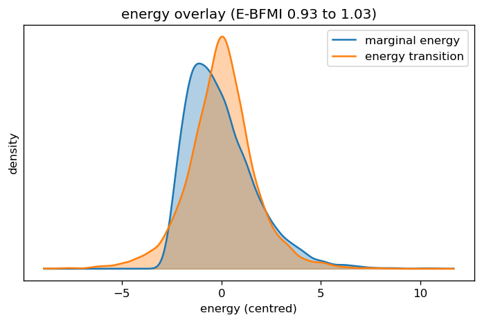
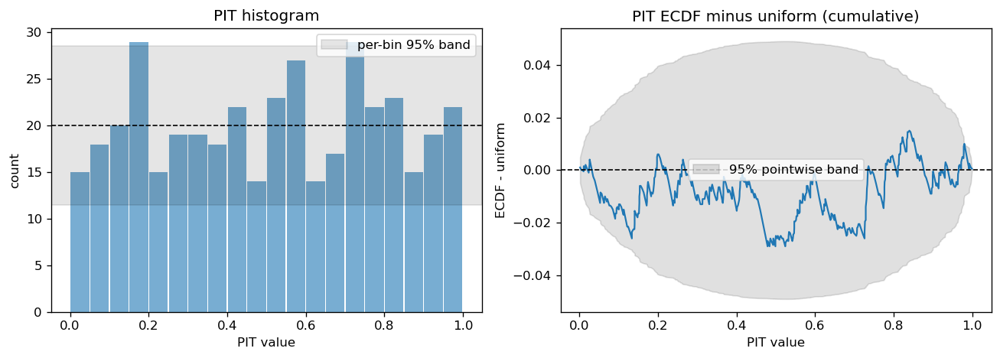
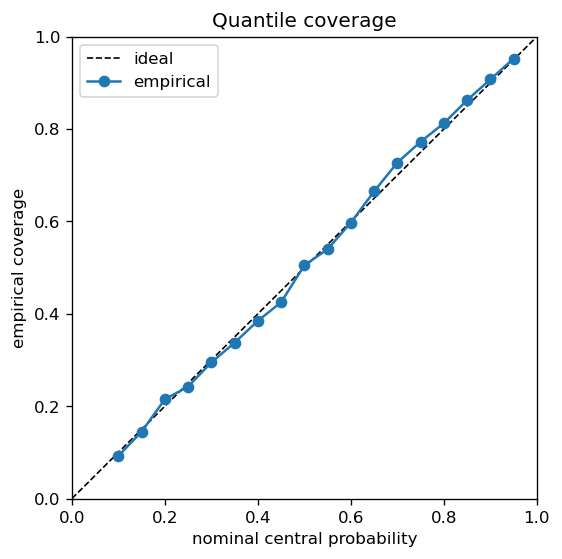
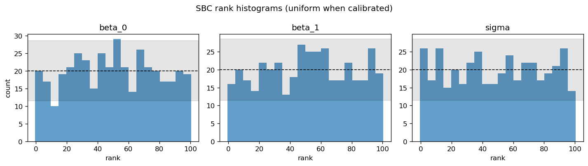

# toy-nuts

A No-U-Turn Sampler written from scratch in pure Python: leapfrog integration,
recursive tree doubling, the no-U-turn criterion and multinomial trajectory
sampling, with a diagnostic and calibration suite. 

It is
written for clarity rather than speed, and it is held to a hard standard. The
sampler is run on a conjugate Bayesian linear regression whose posterior is
Normal-Inverse-Gamma in closed form, so every number it produces can be checked
against the exact answer.

The check now follows: the filled histograms are the sampler's posterior, the black
outline is a large i.i.d. draw from the closed-form posterior, and they overlap well.



The rest of this README is the story behind that picture:
1. the question;
2. the machine that answers it;
3. the evidence that it converged; and
4. the evidence that the uncertainty it reports is honest. 

The same format runs interactively
across the three notebooks in [`notebooks/`](notebooks).

## The question

I observe responses $y$ at scalar inputs $x$ and fit a straight line with
Gaussian noise, $y = \beta_0 + \beta_1 x + \varepsilon$.

The prior is a conjugate Normal-Inverse-Gamma pair.
The prior covariance is set deliberately wide,
so before any data arrives the model entertains a broad fan of lines and pays no
attention to where the points actually fall.



Because the prior is conjugate, the posterior is available in closed form, which
is the whole point: it gives an exact target to sample against.

## The machine

The sampler works on the unconstrained space, with $\sigma$ reparameterised as
$u = \log \sigma$. The potential is the negative log density and the kinetic energy
comes from a Gaussian momentum:

$$
U(q) = -\log \pi(q), \qquad K(p) = \tfrac{1}{2}\, p^\top M^{-1} p, \qquad H(q, p) = U(q) + K(p).
$$

A leapfrog step is a half momentum kick, a full position drift then a half kick,
all at a fixed step size $\epsilon$. NUTS grows a trajectory by doubling it until the
original no-U-turn criterion fires, a state diverges or the depth cap is reached.
The next sample is drawn from the trajectory with each state weighted by its
Boltzmann factor $e^{-H}$, biased towards the newest states so the chain travels as
far as it can.

The model contributes the log density and its analytic gradient, including the
change-of-variables Jacobian for $u = \log \sigma$. The gradient is validated
against finite differences in the test suite, so the dynamics are driven by a
gradient that is known to be correct.

There is no warm-up and no adaptation. The step size and the metric are fixed
inputs, chosen once and held constant. The metric here is diagonal, matched to
the analytic posterior scales, and the step size was picked to be robustly
divergence-free across a small grid of priors and seeds. This keeps the sampler
simple and its behaviour easy to reason about, at the cost of needing a friendly,
well-scaled target.

## The answer

Run four chains and the posterior collapses from the wide prior onto a tight band
that follows the data. This is the first picture in this README - the sampled
marginals laid over the closed-form posterior, including the scale as
$u = \log \sigma$, the space the sampler actually works in. The agreement is not
only visual:
every sampled posterior mean is within 0.71 MCSE of its exact value and the
sampled standard deviations match to within 2%, so the sampler shows no bias and
the right width. Reading the ensemble of fitted lines as summaries gives the
posterior mean line, a 90% credible band for the line itself (uncertainty in
$\beta$ alone) and a wider 90% predictive band that adds the observation noise
$\sigma$.



The posterior recovers the generating line and, more importantly, quantifies how
sure it is about it. Two questions remain: did the sampler actually converge, and
is the uncertainty it reports honest.

## Did it converge?

The convergence diagnostics are all computed from scratch in
[`diagnostics.py`](src/toynuts/diagnostics.py), no ArviZ. Across four chains of
2000 draws each:

| diagnostic            | result            | pass mark         |
|-----------------------|-------------------|-------------------|
| split-Rhat (max)      | 1.0005            | at or below 1.01  |
| bulk ESS (min)        | 5200              | above 400         |
| tail ESS (min)        | 4291              | above 400         |
| divergences           | 0                 | at or near 0      |
| max tree depth        | 3 of a cap of 10  | below the cap     |
| E-BFMI                | 0.93 to 1.03      | above 0.3         |

The traces are fuzzy horizontal bands with no drift or sticking, and the four
per-chain densities lie on top of one another, which is what split-Rhat near 1
then confirms.



The energy diagnostic checks whether momentum refreshment explores the energy
distribution efficiently. The check is on spread: the energy
transition distribution should be about as wide as the marginal energy
distribution, and E-BFMI condenses that comparison into a number near one here.



## Is the uncertainty honest?

Convergence says the sampler explored the posterior. Calibration asks whether
that posterior's uncertainty is honest, and it is checked three ways, all from
scratch in [`calibration.py`](src/toynuts/calibration.py).

The probability integral transform evaluates the posterior predictive CDF at each
held-out point. If the predictive is calibrated these values are $\mathrm{Uniform}(0, 1)$.
The histogram sits inside its per-bin band and the cumulative departure from
uniform stays inside its pointwise band, with a mean of 0.510 against the ideal
0.5.



Read as a calibration curve, the same idea becomes quantile coverage: a nominal
90% interval should contain about 90% of held-out points. The empirical coverage
tracks the diagonal.



Simulation-based calibration tests the inference itself rather than one dataset.
Drawing parameters from the prior, simulating data, refitting and recording the
rank of each true value among its posterior draws, the ranks must be uniform when
the sampler targets the correct posterior. A lean towards the edges would mean
posteriors that are too narrow, a central hump too wide.



A flat PIT, coverage on the diagonal and uniform SBC ranks all point the same
way: the posterior predictive is calibrated on held-out data and the sampler
recovers the prior-to-posterior map without bias.

## The maths in brief

The model is a conjugate regression with a Normal-Inverse-Gamma prior. With $n$
observations and $p$ coefficients the closed-form posterior is again
Normal-Inverse-Gamma:

$$
\begin{aligned}
V_n &= (V_0^{-1} + X^\top X)^{-1}, \\
m_n &= V_n (V_0^{-1} m_0 + X^\top y), \\
a_n &= a_0 + n/2, \\
b_n &= b_0 + \tfrac{1}{2}\left( y^\top y + m_0^\top V_0^{-1} m_0 - m_n^\top V_n^{-1} m_n \right).
\end{aligned}
$$

Here $X$ is the $n \times p$ design matrix and $y$ the $n$ responses, with $n$
the number of observations. The prior is fixed by the mean $m_0$ and covariance
factor $V_0$ of the coefficients, in
$\beta \mid \sigma^2 \sim \mathcal{N}(m_0, \sigma^2 V_0)$, with shape $a_0$ and
scale $b_0$ of $\sigma^2 \sim \text{Inverse-Gamma}(a_0, b_0)$. The data updates
each of these into its posterior counterpart $m_n$, $V_n$, $a_n$ and $b_n$ above.

Sampling is done in $z = (\beta, u)$ with $u = \log \sigma$. The target log density
adds the Jacobian of the $\sigma^2$ to $u$ map, and the linear-in-$u$ terms
collapse to a single coefficient $-(n + p + 2 a_0)\,u$:

$$
\log \pi(z) = -(n + p + 2 a_0)\,u - e^{-2u}\left( \tfrac{1}{2}\lVert y - X\beta \rVert^2 + \tfrac{1}{2}(\beta - m_0)^\top V_0^{-1}(\beta - m_0) + b_0 \right).
$$

The closed-form moments $\mathbb{E}[\beta \mid y] = m_n$, $\mathrm{Cov}[\beta \mid y] = \dfrac{b_n}{a_n - 1} V_n$
and $\mathbb{E}[\sigma^2 \mid y] = \dfrac{b_n}{a_n - 1}$ are the reference the acceptance criteria
score against.

## Layout

```
src/toynuts/      the package: transforms, hamiltonian, integrators, trajectory,
                  transition, sampler, diagnostics, calibration, io and the models
scripts/          run_linear_gaussian.py, make_plots.py, make_readme_figures.py
tests/            analytic and independently referenced checks
notebooks/        01_results, 02_diagnostics, 03_calibration, the narrative above
assets/           the rendered README figures
outputs/          gitignored Parquet runs and figures, one directory per run
```

## Running it

```bash
conda env create -f environment.yml
conda activate toy-nuts
pip install -e .                        # optional: the notebooks also add src/ to the path

python scripts/run_linear_gaussian.py   # run the sampler, write outputs/run_<timestamp>/
python scripts/make_plots.py            # read the run, render the figures
```

The notebooks are the recommended way in. `01_results.ipynb` is the only one that
runs the sampler: it fits the model, draws the figures above and writes the run
and a few derived quantities to `outputs/notebook_run`. `02_diagnostics.ipynb`
and `03_calibration.ipynb` are read-only, interpreting that saved run. The README
figures are regenerated from the same saved run with
`python scripts/make_readme_figures.py`.

## Validation

The end-to-end test recovers the analytic posterior mean and covariance of $\beta$
and the mean of $\sigma^2$ within a small multiple of MCSE, with split-Rhat below
1.01, bulk and tail ESS above 400 per parameter, divergences at or near zero and
E-BFMI above 0.9. The diagnostics themselves are checked against analytic
references: split-Rhat near 1 on i.i.d. draws, ESS against the AR(1) formula and
E-BFMI against a controlled energy series. The calibration functions are checked
against the cases where the answer is known: a uniform PIT and nominal coverage
for a matched predictive, and uniform ranks in the exchangeable case SBC reduces
to. The model's analytic gradient is checked against finite differences, which is
the single most important test, since the dynamics ride on that gradient.

## Licence

MIT.
